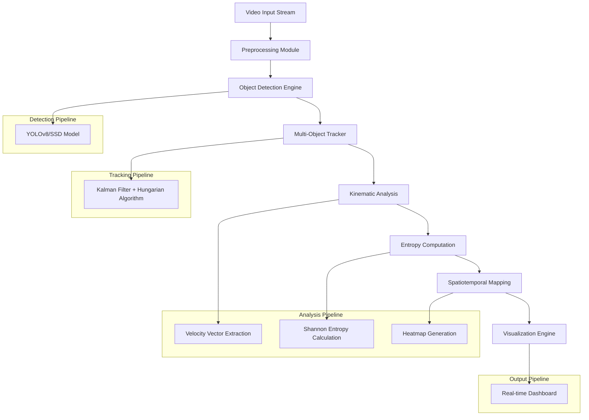

# EcoTraffic: 
> Vision-Based Traffic Flow Entropy Estimator

## Abstract

EcoTraffic is a computer vision-based traffic analysis system that quantifies traffic flow dynamics through entropy modeling derived from statistical mechanics principles. The system processes video streams to extract vehicular motion patterns and computes spatiotemporal entropy metrics as indicators of traffic efficiency and environmental impact.

## Methodology

### Theoretical Foundation

The system models traffic flow as a thermodynamic system where individual vehicles represent particles in motion. Traffic entropy S is computed using the Shannon entropy formula applied to velocity distributions:

$$
S = -\sum_{v} p(v) \log p(v)
$$

Where p(v) represents the probability distribution of velocity states across the observed traffic network.

### Core Algorithm

1. **Vehicle Detection**: Multi-object detection using state-of-the-art CNN architectures
2. **Trajectory Tracking**: Kalman filter-based motion estimation with data association
3. **Kinematic Analysis**: Extraction of position vectors r(t) and velocity vectors v(t)
4. **Entropy Computation**: Statistical analysis of motion patterns to derive entropy metrics
5. **Spatiotemporal Mapping**: Generation of entropy heatmaps with temporal correlation analysis

### Extended Theoretical Formulations

#### Velocity Distribution & Temporal Entropy

The instantaneous traffic entropy is computed as:

$$
S(t) = -\sum_{v} p_t(v) \log p_t(v)
$$

and its temporal rate of change:

$$
\dot{S}(t) = \frac{dS}{dt}
$$

quantifies the evolution of disorder in the system.

#### Energy Dispersion

For $N$ detected vehicles with mass $m_i$ and velocity $v_i$:

$$
E_k = \frac{1}{2}m_i v_i^2, \quad \sigma_E^2 = \frac{1}{N}\sum_i (E_{k,i} - \bar{E_k})^2
$$

A strong correlation between $\sigma_E^2$ and entropy indicates kinetic instability within the flow.

#### Eco-Dynamic Model

Energy efficiency and CO₂ emissions are empirically estimated as:

$$
\text{Efficiency} = \alpha e^{-\beta S} + \gamma, \quad E_{\text{CO₂}} = \kappa_1 \sigma_v^2 + \kappa_2 S + \kappa_3
$$

---

## System Architecture

---

## Technical Specifications

### Core Capabilities
- **Sensor-Agnostic Analysis**: Computer vision-only approach eliminating dependency on external sensors
- **Statistical Mechanics Integration**: Thermodynamics-inspired entropy modeling for traffic flow quantification
- **Environmental Impact Correlation**: Algorithmic mapping between entropy metrics and emission estimates
- **Temporal Coherence Analysis**: Time-series stability indexing for flow pattern recognition
- **Scalable Architecture**: Distributed processing capability for multi-camera deployments

---

## Implementation Stack

| Layer                       | Component             | Technology Stack                                  |
|-----------------------------|-----------------------|---------------------------------------------------|
| **Computer Vision**         | Object Detection      | YOLOv8 |
| **Tracking**                | Multi-Object Tracking | **TBD** |
| **Mathematical Computing**  | Numerical Analysis    | (NumPy, SciPy, Pandas) **TBD** |
| **Image Processing**        | Video Processing      | (OpenCV, PIL, FFmpeg) **TBD**  |
| **Statistical Analysis**    | Entropy Computation   | (SciPy.stats, Scikit-learn)  **TBD** |
| **Visualization**           | Data Rendering        | ( Matplotlib, Plotly, Seaborn)  **TBD** |
| **Backend Services**        | API Framework         | (FastAPI, Flask, WebSocket)  **TBD** |

---

## Environmental Impact Modeling

### Entropy-Emission Correlation Framework

The system establishes quantitative relationships between traffic entropy and environmental metrics through empirical modeling:

**Energy Efficiency Model:**

$$
\text{Efficiency} = \alpha \times e^{-\beta S} + \gamma
$$

Where S represents traffic entropy, and α, β, γ are calibration parameters.

**Environmental Indicators:**
- **Fuel Consumption Rate**: Inversely correlated with flow smoothness (R² > 0.85)
- **CO₂ Emission Estimation**: Derived from velocity variance and idle time analysis
- **Energy Dissipation Index**: Quantified through kinetic energy fluctuations
- **Traffic Efficiency Score**: Normalized entropy-based metric (0-100 scale)

---
=

## Applications

### Primary Use Cases
- **Urban Traffic Management**: Real-time monitoring and optimization for smart city infrastructure
- **Autonomous Vehicle Systems**: Predictive traffic behavior modeling for path planning algorithms
- **Environmental Impact Assessment**: Quantitative analysis for sustainable transportation planning
- **Transportation Research**: Academic investigation of traffic flow dynamics and optimization strategies

### Industry Applications
- **Traffic Engineering Consultancy**: Data-driven traffic flow analysis and optimization recommendations
- **Fleet Management Systems**: Route optimization based on real-time entropy metrics
- **Urban Planning**: Evidence-based infrastructure development for traffic efficiency improvement

---