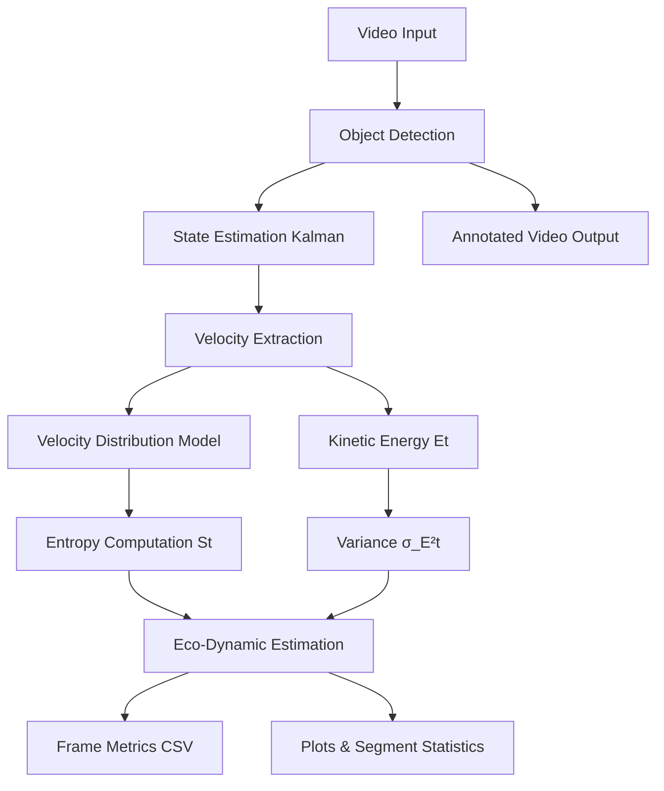

# **EcoTraffic**

> *A Spatiotemporal Entropy & Eco-Dynamics Estimation Framework Using Computer Vision*

---

## **📌 Overview**

**EcoTraffic** is a computational framework that interprets road traffic as a **non-equilibrium dynamical system**, where vehicle motion is modeled using concepts from **statistical mechanics**, **information theory**, and **kinetic theory**.

Rather than focusing on detection or tracking as the "main" feature, the system uses them only as **inputs** to derive:

* **Shannon motion entropy**
* **Velocity-distribution evolution**
* **Kinetic energy variance**
* **Spatiotemporal entropy fields**
* **Eco-dynamic metrics (efficiency + CO₂ proxy)**

EcoTraffic transforms simple roadside video into **analytical signals** describing traffic disorder, motion stability, and energetic inefficiency.

---

# **📐 Theoretical Framework**

## **1. Traffic as a Thermodynamic Ensemble**

Vehicles are treated as particles evolving in time under a non-equilibrium state.
Let p_t(v)  be the empirical velocity distribution at time ( t ):

$$
p_t(v) = \frac{n(v,t)}{N(t)}
$$

The system entropy is the Shannon-Boltzmann entropy:

$$
S(t) = -\sum_{v} p_t(v)\log p_t(v)
$$

Higher entropy → More disorder → Stop–go oscillation
Lower entropy → Stable, fluid flow

---

## **2. Entropy Dynamics**

The temporal evolution of traffic disorder is:

$$
\dot{S}(t) = \frac{dS}{dt}
$$

A positive ( \dot{S} ) indicates traffic deterioration;
a negative ( \dot{S} ) indicates recovery or flow stabilization.

---

## **3. Kinetic Energy Dispersion**

For each tracked vehicle:

$$
E_i(t) = \frac{1}{2} v_i(t)^2
$$

The variance of the kinetic ensemble:

$$
\sigma_E^2(t) = \frac{1}{N(t)}
\sum_{i=1}^{N(t)} (E_i(t) - \bar{E}(t))^2
$$

This σᴱ² acts as a **"motion turbulence"** metric.

---

## **4. Velocity Distribution Modeling**

EcoTraffic constructs a moving velocity window (e.g., last 200 velocities) to estimate:

$$
p_t(v) \approx \text{Histogram}(v_{t - \Delta t : t})
$$

This approximates a non-stationary stochastic process governing driver interactions.

---

## **5. Spatiotemporal Grid Entropy**

The frame is divided into a grid ( G_x \times G_y ).
For each cell ( c ), local entropy is:

$$
S_c = -\sum_v p_c(v)\log p_c(v)
$$

Resulting in a spatial entropy field:

$$
\mathbf{S}_{grid} \in \mathbb{R}^{G_x \times G_y}
$$

---

## **6. Eco-Dynamic Models**

### **6.1 Efficiency Model**

$$
\eta(t) = \alpha e^{-\beta S(t)} + \gamma
$$

Entropy ↑ → Efficiency ↓.

---

### **6.2 CO₂ Proxy Model**

$$
E_{\text{CO₂}}(t)
= k_1, \sigma_E^2(t) + k_2, S(t) + k_3
$$

This captures the intuition that congestion increases both disorder and wasted kinetic energy, resulting in elevated emissions.

---

# **⚙️ System Architecture**

---

# **🧩 Implementation Components**

| Module                   | Description                                      |
| ------------------------ | ------------------------------------------------ |
| **Detection**            | YOLOv8 used only as a state measurement provider |
| **Tracking**             | Kalman Filter + Hungarian assignment (SORT-like) |
| **Kinematic Extraction** | Δx–Δy displacement → velocity → energy           |
| **Entropy Estimation**   | Shannon entropy on rolling velocity PDF          |
| **Energy Dispersion**    | Variance of kinetic energy proxy                 |
| **Spatiotemporal Grid**  | Local entropy fields for structural disorder     |
| **Eco-Dynamics**         | Efficiency + CO₂ estimation                      |
| **Statistical Tests**    | ANOVA, Mann–Whitney on segments                  |

---

# **📊 Output Metrics**

Each frame generates:

| Metric              | Meaning               |
| ------------------- | --------------------- |
| **Entropy S(t)**    | Motion disorder level |
| **σᴱ²(t)**          | Kinetic turbulence    |
| **Efficiency η(t)** | Eco-efficiency proxy  |
| **CO₂ Estimate**    | Emission trend proxy  |
| **n_tracks**        | Active vehicles       |
| **Mean Speed**      | Avg. per-frame motion |

All values are saved into **frame_metrics.csv**.

---

# **📈 Statistical Analysis**

EcoTraffic includes a built-in segment comparison system:

### **1. One-Way ANOVA**

Tests whether entropy / CO₂ significantly differ across temporal segments.

$$
F = \frac{SS_\text{between}}{SS_\text{within}}
$$

---

### **2. Mann–Whitney U Test**

Non-parametric pairwise test:

$$
U = \min(U_1, U_2)
$$

Used for robust comparisons of:

* Entropy
* CO₂ estimate
* Kinetic variance

---

# **🚀 Key Features**

* Thermodynamics-inspired traffic analysis
* Velocity-distribution entropy modeling
* Kinetic variance for turbulence estimation
* Eco-dynamic approximation
* Grid-wise spatiotemporal disorder mapping
* Segment statistics for comparative research
* Fully video-based (no sensors required)
* Clean, extensible Python implementation

---

# **🔬 Research Applications**

* Traffic as a **statistical mechanical system**
* Study of **phase transitions** (free flow → congestion)
* Modeling **velocity fluctuations**
* Eco-efficiency estimation from motion patterns
* Entropy-based mobility research
* Spatiotemporal disorder analysis
* Transportation behavior modeling

---

# **⚠ Limitations**

* Speed is relative (pixel-based, not calibrated in m/s)
* CO₂ proxy is conceptual, not physically scaled
* Single-camera perspective may introduce occlusion noise
* Entropy uses velocity magnitude, not vector fields

---

# **📚 Conclusion**

EcoTraffic demonstrates how simple video data can be transformed into **rich theoretical signals** through:

* entropy modeling
* energy dispersion
* dynamical state reconstruction
* statistical testing
* eco-dynamic estimation

It reframes traffic analysis from a **computer vision problem** to a **physical, information-theoretic modeling problem**, combining modern CV pipelines with deep mathematical concepts.

