# [**EcoTraffic**](scripts/final.ipynb)


> *A Spatiotemporal Entropy & Eco-Dynamics Estimation Framework Using Computer Vision*

---

## **📌 Overview**

**EcoTraffic** transforms roadside video into a set of **environment-aware motion disorder metrics** using:

* Object detection (YOLOv8)
* Motion tracking (Kalman + SORT assignment)
* Velocity time-series modeling
* Shannon entropy of velocity distributions
* Kinetic energy variance
* Per-cell spatiotemporal entropy fields
* Eco-dynamics proxies (efficiency + CO₂ trend estimate)

This project fits directly into the theme **Automotive × Object Detection × Environment** by converting simple video into **interpretable environmental indicators** of traffic flow.

Unlike classical CV projects, EcoTraffic does **not** focus on detection accuracy.
Detection is merely a *measurement layer*.
The core idea is **physical modeling of traffic motion** through entropy and kinetic dispersion.

All metrics are logged into **frame_metrics.csv**, enabling deep time-series analysis and environmental trend estimation.

---

# **📐 Theoretical Framework**

## **1. Velocity Distribution Estimation**

Using tracked vehicle centroids:

$$
v_i(t) = \sqrt{(x_i(t)-x_i(t-\Delta t))^2 + (y_i(t)-y_i(t-\Delta t))^2}
$$

A rolling global velocity window of size ( W = 200 ) (as in the code) forms an empirical PDF:

$$
p_t(v) = \frac{\text{hist}(v_{t-W:t})}{\sum \text{hist}}
$$

This distribution evolves over time and serves as the basis for entropy and energy statistics.

---

## **2. Motion Entropy (Global Shannon Entropy)**

$$
S(t) = -\sum_{v} p_t(v) \log(p_t(v))
$$

Interpretation:

* **High entropy** → diverse velocities → unstable traffic → stop-go turbulence
* **Low entropy** → uniform movement → stable traffic flow

Your code computes this exactly via a histogram over recent velocity magnitudes.

---

## **3. Kinetic Energy Dispersion**

For each instantaneous speed:

$$
E_i(t) = \frac{1}{2} v_i(t)^2
$$

Then global variance:

$$
\sigma_E^2(t) = \textrm{Var}(E_i(t))
$$

This reflects **motion turbulence** and “jerkiness” in the flow.

---

## **4. Spatiotemporal Grid Entropy (Local Disorder Field)**

The frame is divided into a grid:

* Width = 16 cells
* Height = 9 cells
* Each cell stores up to 100 recent speeds

For each cell ( c ):

$$
S_c = -\sum_{v} p_c(v)\log p_c(v)
$$

Producing a **2D entropy heatmap** (not displayed in the output video but computed internally).

---

## **5. Eco-Dynamic Models**

These models are deliberately simplified proxies (as you wrote in code).

### **Efficiency Estimate**

$$
\eta(t) = \alpha e^{-\beta S(t)} + \gamma
$$

Used constants:

```
ALPHA = 1.0
BETA = 1.0
GAMMA = 0.0
```

---

### **CO₂ Trend Estimate (Proxy)**

$$
E_{\text{CO₂}}(t) = k_1 \sigma_E^2(t) + k_2 S(t) + k_3
$$

These are **not physical CO₂ units**, only a **trend signal** combining turbulence & disorder.

The code uses:

```
K1 = 1.0
K2 = 0.5
K3 = 0.0
```

---

# **⚙️ System Architecture**

```mermaid
flowchart TD
    A[Video Input] --> B[YOLOv8 Detection]
    B --> C[Kalman Filter Tracking]
    C --> D[Velocity Extraction]
    D --> E[Rolling Velocity Window]
    E --> F[Shannon Entropy S_t]
    D --> G[Kinetic Energy Computation]
    G --> H[Variance σ_E²_t]
    F --> I[Eco-Dynamic Estimation]
    H --> I
    I --> J[frame_metrics.csv]
    I --> K[Analysis & Plots]
    B --> L[Annotated Output Video]
```



---

# **🧩 Implementation Breakdown**

| Module            | Description                                         |
| ----------------- | --------------------------------------------------- |
| Detection         | YOLOv8-l (only for bounding boxes)                  |
| Tracking          | Kalman Filter (x, y, vx, vy) + Hungarian assignment |
| Velocity Modeling | Δx-Δy displacement per frame                        |
| Entropy           | Shannon entropy on histogram of last 200 velocities |
| Energy Dispersion | Variance of kinetic energies                        |
| Grid Entropy      | Local cell-wise velocity entropy map                |
| Eco-Dynamics      | Efficiency + CO₂ trend proxy                        |
| Statistics        | Pearson, Spearman, ANOVA, Mann-Whitney              |

---

# **📊 Output Metrics (Per Frame)**

Exported to [**frame_metrics.csv**](output/frame_metrics.csv):

| Column           | Meaning                            |
| ---------------- | ---------------------------------- |
| frame            | Frame index                        |
| entropy          | Shannon entropy ( S(t) )           |
| sigma_E2         | Kinetic energy variance            |
| efficiency       | ( \eta(t) )                        |
| E_co2            | CO₂ trend estimate                 |
| n_tracks         | Number of active objects           |
| mean_speed_frame | Avg. instantaneous per-frame speed |

---

# **📈 Statistical Analysis (Built-in)**


### **1. Pearson & Spearman Correlations**

The correlation analysis yielded 

$$
\begin{aligned}
\rho_{\text{Pearson}}  &= -0.0151,\\[4pt]
\rho_{\text{Spearman}} &= -0.0407.
\end{aligned}
$$

$$
\text{Both correlations indicate no linear or monotonic relationship between entropy and the CO}_2 \text{ proxy.}
$$


### **2. ANOVA Across Segments**

$$
\begin{aligned}
F_{\text{entropy}} &= 2.4889,\quad p = 0.1149,\\[4pt]
F_{\text{CO}_2}    &= 2.0452,\quad p = 0.1529.
\end{aligned}
$$

$$
\text{Neither metric shows statistically significant differences across temporal segments.}
$$


### **3. Mann-Whitney U Tests**
$$
\begin{aligned}
p_{\text{entropy}} &= 0.6577,\\[4pt]
p_{\text{CO}_2}    &= 0.0003.
\end{aligned}
$$


$$
\text{Entropy shows no significant difference, while the CO}_2 \text{ proxy exhibits a strong segment-level difference.}
$$
---

# **🎥 Output **

### **1. Annotated Processed Video**

[**`/outputs/eco_entropy_output.mp4`**](output/eco_entropy_output.mp4)

→ Shows bounding boxes, track IDs, entropy, σE², efficiency, CO₂.


---

### **2. Entropy Time-Series Plot**


### **3. CO₂ Estimate Time-Series Plot**


### **4. Kinetic Energy Variance Plot**


### **5. Efficiency Plot**


---

# **📁 Logs**

All numerical results are saved into:

[frame_metrics.csv](output/frame_metrics.csv)


This CSV is the **primary dataset** for downstream analytics and environmental insights.

---

# **🚀 Key Contributions**

* A **thermodynamics-inspired modeling** of traffic flow
* Direct extraction of **environment-related signals** from plain video
* Integration of **object detection + tracking + information theory**
* A practical framework for **environmental mobility analytics**
* Full reproducibility with a single Python file

---

# **⚠ Limitations (Accurate to Your Implementation)**

* Speeds are in **pixels/frame**, not physical units
* CO₂ output is a **proxy**, not physically calibrated
* Single-camera perspective may cause occlusions
* Entropy computed only on **velocity magnitude**, not directional fields
* Grid entropy computed but **not rendered visually** in the output video (by design)

---

# **📚 Conclusion**

EcoTraffic reframes traffic analysis as a **non-equilibrium dynamical system**, combining:

* entropy modeling
* kinetic energy variance
* stochastic velocity distributions
* eco-dynamic proxies
* segment-wise statistical tests

This positions the project strongly within **Automotive**, **Object Detection**, and **Environment**, making it an ideal submission for competitions in this theme.

